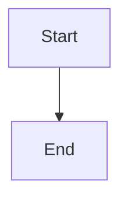

# Diagram Format

## รูปแบบ Diagram มาตรฐาน

### ASCII/ANSI Diagram

ใช้เมื่อต้องการแสดง flow หรือ structure แบบง่าย

```text
┌─────────┐
│ Step 1  │
└────┬────┘
     │
     ▼
┌─────────┐
│ Step 2  │
└─────────┘
```

### Mermaid Diagram (ถ้ารองรับ)

```markdown

```

### When to Use

- แสดง flow ของการทำงาน
- แสดง architecture
- แสดง data flow
- แสดง relationships ระหว่าง components

### Best Practices

- ใช้ ASCII/ANSI เมื่อต้องความ simple
- ใช้ Mermaid เมื่อต้องความ interactive
- ให้ diagram อ่านง่ายและเข้าใจ
