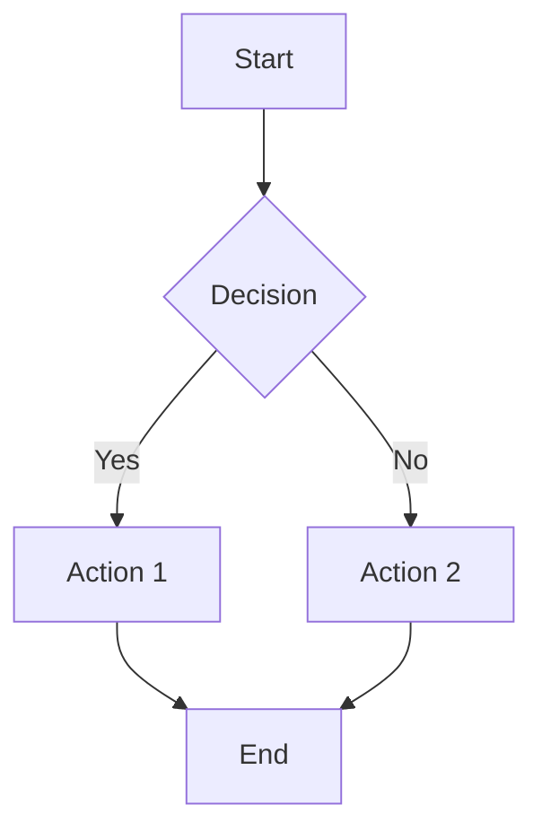
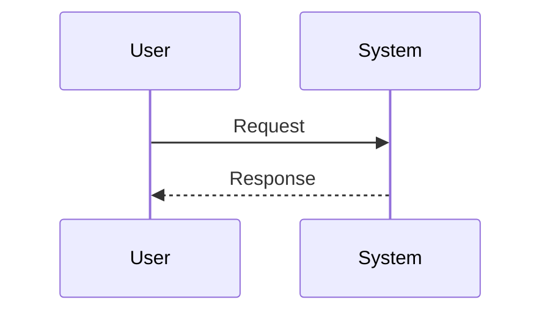
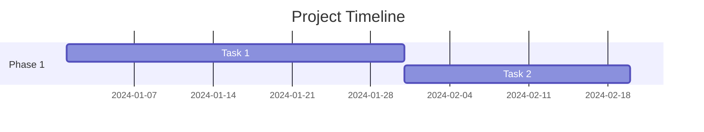
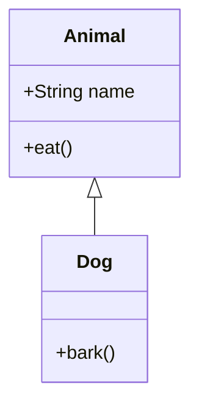
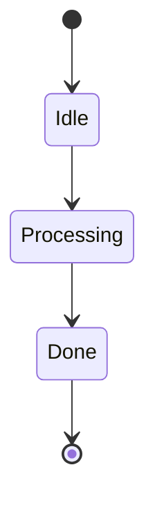
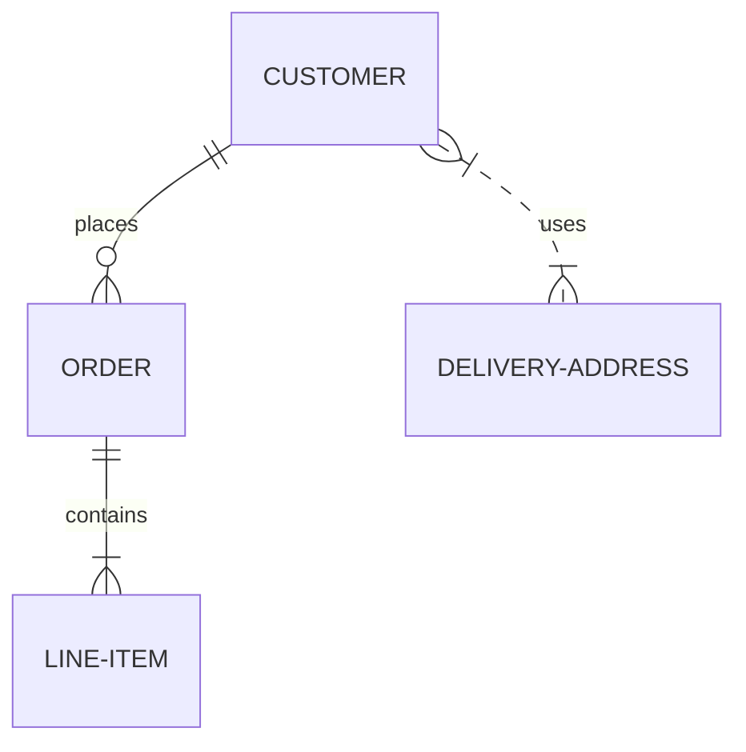
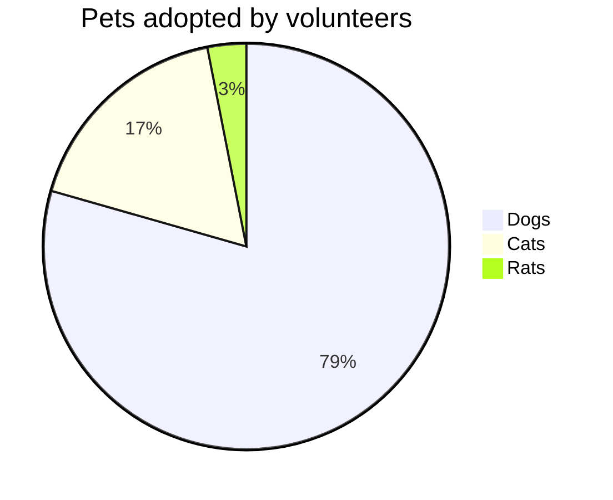

# Mermaid Variants Format

## รูปแบบ Mermaid Diagrams หลากหลาย

### Flowchart

```markdown

```

### Sequence Diagram

```markdown

```

### Gantt Chart

```markdown

```

### Class Diagram

```markdown

```

### State Diagram

```markdown

```

### ER Diagram

```markdown

```

### Pie Chart

```markdown

```

### When to Use

- Flowchart: แสดง process flow
- Sequence: แสดง interactions
- Gantt: แสดง timeline
- Class: แสดง class structure
- State: แสดง state transitions
- ER: แสดง database schema
- Pie: แสดง proportions

### Best Practices

- เลือก diagram type ที่เหมาะสม
- ให้ diagram อ่านง่าย
- ใช้ descriptive labels
- หลีกเลี่ยง diagrams ที่ซับซ้อนเกินไป
