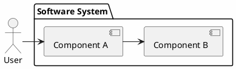
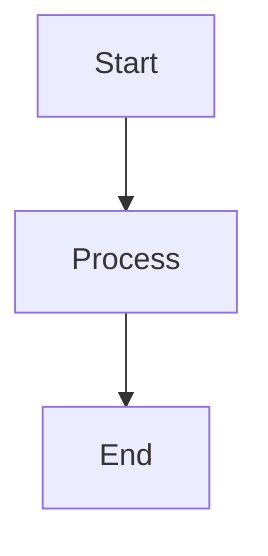

# Installation

## การเตรียม Environment สำหรับ Software Design

### เครื่องมือที่จำเป็น

- **IDE**: VS Code, IntelliJ IDEA, หรือ IDE ที่ชอบ
- **Diagram Tools**: PlantUML, Mermaid, Draw.io, หรือ Lucidchart
- **Documentation**: Markdown, Sphinx, หรือ Docusaurus
- **Version Control**: Git, GitHub, GitLab
- **Collaboration**: Figma, Miro, หรือ Mural

### การติดตั้ง

#### บน Linux

```bash
# ติดตั้ง VS Code
wget -qO- https://packages.microsoft.com/keys/microsoft.asc | gpg --dearmor > packages.microsoft.gpg
sudo install -o root -g root -m 644 packages.microsoft.gpg /etc/apt/trusted.gpg.d/
sudo sh -c 'echo "deb [arch=amd64,arm64,armhf signed-by=/etc/apt/trusted.gpg.d/packages.microsoft.gpg] https://packages.microsoft.com/repos/code stable main" > /etc/apt/sources.list.d/vscode.list'
sudo apt update
sudo apt install code

# ติดตั้ง PlantUML
sudo apt install plantuml

# ติดตั้ง Graphviz (สำหรับ diagram)
sudo apt install graphviz
```

#### บน macOS

```bash
# ติดตั้ง VS Code ผ่าน Homebrew
brew install --cask visual-studio-code

# ติดตั้ง PlantUML
brew install plantuml

# ติดตั้ง Graphviz
brew install graphviz
```

#### บน Windows

```powershell
# ติดตั้ง VS Code
winget install Microsoft.VisualStudioCode

# ติดตั้ง PlantUML
winget install PlantUML.PlantUML

# ติดตั้ง Graphviz
winget install Graphviz.Graphviz
```

### การตั้งค่า VS Code Extensions

```bash
# ติดตั้ง extensions ที่จำเป็น
code --install-extension ms-azuretools.vscode-docker
code --install-extension eamodio.gitlens
code --install-extension jebbs.plantuml
code --install-extension bierner.markdown-mermaid
code --install-extension PKief.material-icon-theme
```

### การตั้งค่า Project

```bash
# สร้าง project structure
mkdir software-design
cd software-design
mkdir docs diagrams src tests

# เริ่ม Git repository
git init
echo "# Software Design" > README.md
git add .
git commit -m "Initial commit"
```

### Documentation Tools

#### PlantUML Setup



#### Mermaid Setup

```markdown

```

### Dependencies

- **Diagramming**: PlantUML, Mermaid, Draw.io
- **Documentation**: Markdown, Sphinx, Docusaurus
- **Collaboration**: Figma, Miro, Mural
- **Version Control**: Git, GitHub, GitLab
