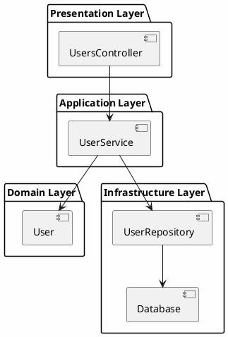

# Quick Start

## เริ่มต้น Software Design อย่างรวดเร็ว

### Step 1: สร้าง Project Structure

```bash
mkdir software-design-demo
cd software-design-demo
mkdir src tests docs
```

### Step 2: สร้าง Simple Domain Model

**src/Models/User.cs**:
```csharp
public class User
{
    public Guid Id { get; private set; }
    public string Email { get; private set; }
    public string Name { get; private set; }
    
    public User(string email, string name)
    {
        if (string.IsNullOrWhiteSpace(email))
            throw new ArgumentException("Email is required");
        
        Id = Guid.NewGuid();
        Email = email;
        Name = name;
    }
    
    public void UpdateName(string name)
    {
        if (string.IsNullOrWhiteSpace(name))
            throw new ArgumentException("Name is required");
        
        Name = name;
    }
}
```

### Step 3: สร้าง Repository Interface

**src/Interfaces/IUserRepository.cs**:
```csharp
public interface IUserRepository
{
    Task<User> GetByIdAsync(Guid id);
    Task AddAsync(User user);
    Task UpdateAsync(User user);
    Task DeleteAsync(Guid id);
}
```

### Step 4: สร้าง Service Layer

**src/Services/UserService.cs**:
```csharp
public class UserService
{
    private readonly IUserRepository _repository;
    
    public UserService(IUserRepository repository)
    {
        _repository = repository;
    }
    
    public async Task<User> CreateUserAsync(string email, string name)
    {
        var user = new User(email, name);
        await _repository.AddAsync(user);
        return user;
    }
    
    public async Task UpdateUserNameAsync(Guid id, string name)
    {
        var user = await _repository.GetByIdAsync(id);
        if (user == null)
            throw new NotFoundException($"User {id} not found");
        
        user.UpdateName(name);
        await _repository.UpdateAsync(user);
    }
}
```

### Step 5: สร้าง API Controller

**src/Controllers/UsersController.cs**:
```csharp
[ApiController]
[Route("api/[controller]")]
public class UsersController : ControllerBase
{
    private readonly UserService _userService;
    
    public UsersController(UserService userService)
    {
        _userService = userService;
    }
    
    [HttpPost]
    public async Task<ActionResult<User>> CreateUser(CreateUserRequest request)
    {
        var user = await _userService.CreateUserAsync(request.Email, request.Name);
        return CreatedAtAction(nameof(GetUser), new { id = user.Id }, user);
    }
    
    [HttpGet("{id}")]
    public async Task<ActionResult<User>> GetUser(Guid id)
    {
        var user = await _userService.GetByIdAsync(id);
        if (user == null)
            return NotFound();
        
        return Ok(user);
    }
}
```

### Step 6: สร้าง Dependency Injection Setup

**src/Startup.cs**:
```csharp
public class Startup
{
    public void ConfigureServices(IServiceCollection services)
    {
        services.AddScoped<IUserRepository, UserRepository>();
        services.AddScoped<UserService>();
        services.AddControllers();
    }
    
    public void Configure(IApplicationBuilder app, IWebHostEnvironment env)
    {
        if (env.IsDevelopment())
        {
            app.UseDeveloperExceptionPage();
        }
        
        app.UseRouting();
        app.UseEndpoints(endpoints =>
        {
            endpoints.MapControllers();
        });
    }
}
```

### Step 7: สร้าง Unit Tests

**tests/UserServiceTests.cs**:
```csharp
public class UserServiceTests
{
    [Fact]
    public async Task CreateUser_ShouldReturnUser()
    {
        // Arrange
        var mockRepository = new Mock<IUserRepository>();
        var service = new UserService(mockRepository.Object);
        
        // Act
        var user = await service.CreateUserAsync("test@example.com", "Test User");
        
        // Assert
        Assert.NotNull(user);
        Assert.Equal("test@example.com", user.Email);
        Assert.Equal("Test User", user.Name);
    }
    
    [Fact]
    public async Task CreateUser_WithInvalidEmail_ShouldThrow()
    {
        // Arrange
        var mockRepository = new Mock<IUserRepository>();
        var service = new UserService(mockRepository.Object);
        
        // Act & Assert
        await Assert.ThrowsAsync<ArgumentException>(
            () => service.CreateUserAsync("", "Test User"));
    }
}
```

### Step 8: สร้าง Architecture Diagram

**docs/architecture.puml**:


### Step 9: Build และ Run

```bash
# Build
dotnet build

# Run tests
dotnet test

# Run application
dotnet run
```

### Step 10: Test API

```bash
# Create user
curl -X POST http://localhost:5000/api/users \
  -H "Content-Type: application/json" \
  -d '{"email":"test@example.com","name":"Test User"}'

# Get user
curl http://localhost:5000/api/users/{id}
```

### Next Steps

1. อ่าน `key-concept.md` สำหรับ concepts เพิ่มเติม
2. ดู `how-it-works.md` สำหรับ design process อย่างละเอียด
3. ศึกษา `architecture.md` สำหรับ architecture patterns
4. ทำตาม `best-practices.md` สำหรับ production-ready code
5. ดู `patterns.md` สำหรับ design patterns ที่ใช้บ่อย
