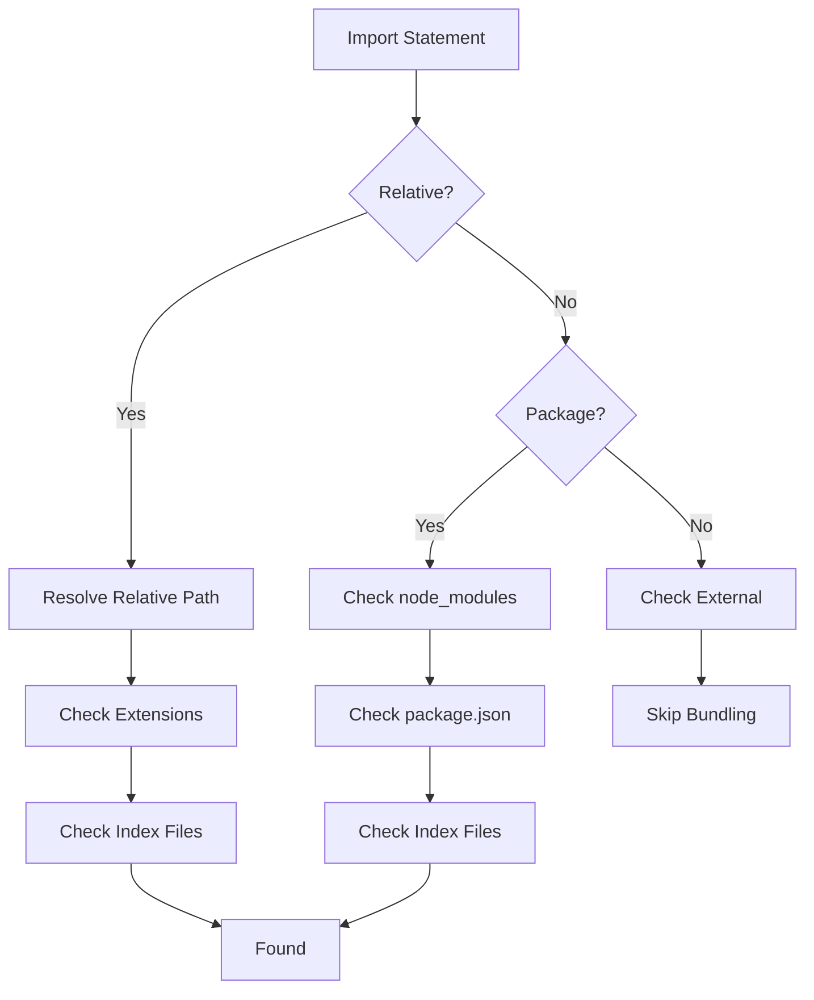

# Module Resolution

## Purpose

เข้าใจวิธีการ resolve module paths ใน Rolldown

## Scope

- Resolution algorithm
- Entry points
- External modules
- Resolution order

## Overview

Module resolution คือกระบวนการแปลง import paths เป็น absolute file paths

```typescript
import { foo } from './utils'      // Relative import
import { bar } from 'lodash'        // External import
import { baz } from '@package/lib' // Scoped package
```

## Resolution Algorithm

### 1. Entry Point Resolution

Rolldown เริ่มจาก entry points ที่ระบุใน config:

```typescript
export default defineConfig({
  input: {
    main: 'src/main.ts',    // Entry point
    worker: 'src/worker.ts',
  },
})
```

### 2. Relative Import Resolution

Relative imports (`./` หรือ `../`) ถูก resolve ตาม current module:

```typescript
// src/main.ts
import { foo } from './utils'  // → src/utils.ts
import { bar } from '../lib'    // → lib/index.ts
```

**Resolution Order:**
1. Check if path exists with `.ts` extension
2. Check if path exists with `.js` extension
3. Check if path is directory with `index.ts`
4. Check if path is directory with `index.js`

### 3. Package Import Resolution

Package imports ถูก resolve ตาม `node_modules`:

```typescript
import { foo } from 'lodash'  // → node_modules/lodash/index.js
```

**Resolution Order:**
1. Check `package.json` → `main` field
2. Check `package.json` → `module` field (ESM)
3. Check `package.json` → `exports` field
4. Check `index.js` or `index.ts`

### 4. Scoped Package Resolution

Scoped packages ถูก resolve แบบเดียวกับ regular packages:

```typescript
import { foo } from '@rolldown/plugin-commonjs'
// → node_modules/@rolldown/plugin-commonjs/index.js
```

## External Modules

External modules คือ dependencies ที่ไม่ถูก bundle:

```typescript
export default defineConfig({
  external: ['react', 'react-dom'],
})
```

### External Patterns

**Array:**
```typescript
external: ['react', 'react-dom', 'lodash']
```

**Function:**
```typescript
external: (id) => id.startsWith('react') || id.includes('lodash')
```

**RegExp:**
```typescript
external: /node_modules/
```

### Why External?

- **Performance**: ลดขนาด bundle โดยไม่ bundle dependencies
- **CDN**: ใช้ dependencies จาก CDN
- **Peer Dependencies**: Dependencies ที่ควรถูก provide โดย consumer

## Module Resolution Options

### resolve.mainFields

กำหนด fields ใน `package.json` ที่ใช้ resolve:

```typescript
export default defineConfig({
  resolve: {
    mainFields: ['module', 'main'],
  },
})
```

### resolve.extensions

กำหนด extensions ที่ resolve:

```typescript
export default defineConfig({
  resolve: {
    extensions: ['.ts', '.js', '.json'],
  },
})
```

### resolve.alias

กำหนด aliases สำหรับ paths:

```typescript
export default defineConfig({
  resolve: {
    alias: {
      '@': './src',
      '@components': './src/components',
    },
  },
})
```

**Usage:**
```typescript
import Button from '@components/Button'
// → ./src/components/Button
```

## Common Issues

### Module Not Found

**Problem:**
```
Error: Cannot find module './utils'
```

**Solution:**
- ตรวจสอบ path ถูกต้อง
- ตรวจสอบ file extension
- ตรวจสอบ file มีอยู่จริง

### Circular Dependencies

**Problem:**
```typescript
// a.ts
import { b } from './b'

// b.ts
import { a } from './a'
```

**Solution:**
Rolldown จัดการ circular dependencies อัตโนมัติ แต่ควรหลีกเลี่ยง:
- Refactor code
- ใช้ dependency injection
- แยก shared logic

### Side Effects

**Problem:**
Module ที่มี side effects ถูก tree-shake ออก

**Solution:**
```typescript
export default defineConfig({
  treeshake: {
    moduleSideEffects: ['no-external'],
  },
})
```

## Resolution Order Summary



## Best Practices

1. **Use Explicit Extensions**: ระบุ extensions ชัดเจน
   ```typescript
   import { foo } from './utils.ts'  // Good
   import { foo } from './utils'      // OK
   ```

2. **Use Aliases for Clean Paths**: ใช้ aliases สำหรับ paths ที่ซับซ้อน
   ```typescript
   import Button from '@/components/Button'
   ```

3. **External Large Libraries**: External libraries ที่ใหญ่
   ```typescript
   external: ['react', 'react-dom', 'lodash']
   ```

4. **Avoid Circular Dependencies**: ออกแบบ architecture ให้ไม่มี circular dependencies

## See Also

- [Three-Stage Pipeline](./three-stage-pipeline.md)
- [Tree Shaking](./tree-shaking.md)
- [Configuration Reference](../../references/configuration.md)
