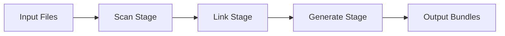
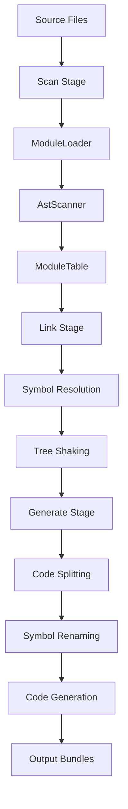

# Three-Stage Pipeline

## Purpose

เข้าใจการทำงานของ Rolldown bundler ผ่าน three-stage pipeline: Scan, Link, และ Generate

## Scope

- Scan Stage: Module discovery and parsing
- Link Stage: Symbol resolution and tree-shaking
- Generate Stage: Code generation and chunking

## Overview

Rolldown ใช้ three-stage pipeline ในการ bundle code:



## Scan Stage

### Purpose

ค้นพบและอ่านไฟล์ทั้งหมดใน module graph และแปลงเป็น AST

### Process

1. **Resolve Entry Points**: หา entry points จาก config
2. **Load Modules**: อ่านไฟล์จาก disk
3. **Parse AST**: แปลง source code เป็น AST ด้วย `oxc_parser`
4. **Extract Metadata**: ดึงข้อมูล imports, exports, และ symbols
5. **Build Module Graph**: สร้าง graph ของ dependencies

### Key Components

**ModuleLoader**: จัดการการ load modules แบบ concurrent ด้วย tokio channels

**AstScanner**: Visitor ที่ walk AST เพื่อ extract:
- `StmtInfo`: Metadata ของแต่ละ statement
- `ImportRecord`: Records ของ imports/exports
- `SymbolRef`: References ไปยัง symbols

**Example:**
```typescript
// src/index.ts
import { foo } from './utils'
export const bar = 'hello'
```

After Scan Stage:
- `ModuleIdx`: Unique ID สำหรับแต่ละ module
- `SymbolRef`: `(ModuleIdx, SymbolId)` tuple
- `ImportRecord`: Record ของ import จาก `./utils`

### Output

- `ModuleTable`: Table ของทุก modules
- `SymbolRefDb`: Database ของทุก symbols
- `ImportRecords`: Records ของทุก imports

## Link Stage

### Purpose

เชื่อมโยง symbols ระหว่าง modules และทำ tree-shaking

### Process

1. **Resolve Imports**: Map imports ไปยัง exports จริง
2. **Bind Symbols**: เชื่อมโยง import references กับ export declarations
3. **Tree Shaking**: ลบ code ที่ไม่ถูกใช้
4. **Detect Side Effects**: ตรวจสอบ side effects ของ modules

### Key Components

**Symbol Resolution**: แปลง import paths เป็น `SymbolRef`

```typescript
// Before Link
import { foo } from './utils'

// After Link
import { foo: SymbolRef(ModuleIdx(2), SymbolId(5)) } from './utils'
```

**Tree Shaking**: ลบ statements ที่ไม่ถูกใช้

```typescript
// Before Tree Shaking
export const used = 'used'
export const unused = 'unused'

// After Tree Shaking
export const used = 'used' // unused ถูกลบ
```

**Module Side Effects**: ตรวจสอบว่า module มี side effects หรือไม่

| Option | Description |
|--------|-------------|
| `'all'` | ทุก modules มี side effects |
| `'no-external'` | เฉพาะ external modules มี side effects |
| `false` | ไม่มี side effects |

### Output

- Resolved symbol bindings
- Tree-shaken module graph
- Side effect annotations

## Generate Stage

### Purpose

สร้าง output code จาก module graph ที่ผ่าน tree-shaking แล้ว

### Process

1. **Code Splitting**: กำหนด chunk boundaries
2. **Symbol Deconfliction**: แก้ปัญหา naming conflicts
3. **Scope Hoisting**: Optimize scope ของ variables
4. **Code Generation**: แปลง AST เป็น string code
5. **Minification**: Minify code ด้วย `oxc_minifier`
6. **Source Map Generation**: สร้าง source maps

### Key Components

**Code Splitting**: แบ่ง modules เป็น chunks ตาม entry points

```typescript
// Input
entry: {
  main: 'src/main.ts',
  worker: 'src/worker.ts',
}

// Output
dist/
  main.js        // main entry chunk
  worker.js      // worker entry chunk
  chunk-abc.js   // shared chunk
```

**Symbol Renaming**: เปลี่ยนชื่อ symbols เพื่อลดขนาด

```typescript
// Before
export function veryLongFunctionName() {}

// After
export function a() {}
```

**Module Finalization**: Wrap modules ตาม output format

```typescript
// ESM format
export { foo } from './utils'

// CJS format
Object.defineProperty(exports, '__esModule', { value: true });
exports.foo = void 0;
```

### Output Formats

| Format | Description | Use Case |
|--------|-------------|----------|
| `esm` | ES Modules | Modern browsers, Node.js |
| `cjs` | CommonJS | Node.js compatibility |
| `iife` | IIFE | Browser globals |
| `umd` | UMD | Universal modules |

## Data Flow



## Performance Optimizations

### Incremental Builds

ใน watch mode, Rolldown ใช้ `HybridIndexVec` เพื่อ:
- Full Scan: ใช้ `IndexVec` สำหรับ performance สูงสุด
- Partial Scan: ใช้ `Map` สำหรับ update เฉพาะ modules ที่เปลี่ยน

### Parallel Processing

- Module loading ทำงานแบบ parallel ด้วย tokio
- AST scanning ทำงานแบบ concurrent

### Caching

- Build cache สำหรับ incremental builds
- AST cache สำหรับ modules ที่ไม่เปลี่ยน

## Comparison with Rollup

| Feature | Rolldown | Rollup |
|---------|----------|--------|
| Language | Rust | JavaScript |
| Parser | oxc_parser | acorn |
| Performance | 10-100x faster | Baseline |
| Tree Shaking | Advanced | Advanced |
| Plugin API | Compatible | Native |

## Summary

| Stage | Purpose | Output |
|-------|---------|--------|
| **Scan** | Discover and parse modules | ModuleTable, SymbolRefDb |
| **Link** | Resolve symbols and tree-shake | Resolved bindings |
| **Generate** | Create output code | Bundles, chunks |

## See Also

- [Module Resolution](./module-resolution.md)
- [Tree Shaking](./tree-shaking.md)
- [Code Splitting](./code-splitting.md)
- [Plugin System](./plugin-system.md)
