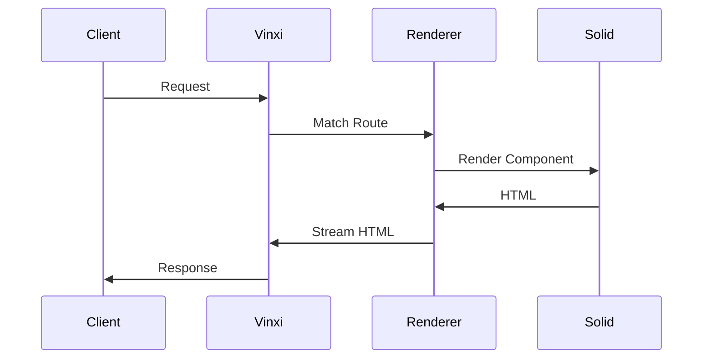

## Vinxi คืออะไร

Vinxi เป็น meta-framework ที่เป็นพื้นฐานของ Solid Start จัดการ core infrastructure เช่น routing, server-side rendering, และ build tasks

## สถาปัตยกรรม Vinxi

```
Vinxi Core:
├── Router System → File-Based Routing
├── SSR Engine → Islands Architecture
├── Build System → Deployment Targets
└── Deployment Targets

SolidStart Layer:
├── File-Based Routing → Server Functions → Middleware
└── Islands Architecture
```

## Core Components

### Router System

Vinxi ใช้ Radix Tree Router สำหรับ file-based routing:

- **Fast matching**: O(k) โดยที่ k คือความยาวของ path
- **Dynamic routes**: รองรับ `[param]` และ `[...catchAll]`
- **Nested routes**: รองรับ layouts และ nested routing

### SSR Engine



### Build System

Vinji ใช้ Vite สำหรับ build:

- **Fast HMR**: Hot Module Replacement
- **Code splitting**: Auto code splitting ตาม routes
- **Tree shaking**: Remove unused code
- **Asset optimization**: Optimize images, fonts

## Deployment Targets

Vinxi รองรับหลาย deployment targets:

| Target | Description |
|--------|-------------|
| **Node.js** | Standard server deployment |
| **Edge** | Cloudflare Workers, Vercel Edge |
| **Bun** | Bun native runtime |
| **Deno** | Deno Deploy |
| **Static** | Static site generation |

## Configuration

```typescript
// app.config.ts
export default defineConfig({
  // Vinxi configuration
  router: {
    base: "/app",
  },
  ssr: true,
  streaming: true,
});
```

## Benefits

- **Unified DX**: ประสบการณ์การพัฒนาที่สม่ำเสมอ
- **Flexible deployment**: Deploy ได้หลาย platforms
- **Performance**: Fast build และ optimized output
- **Type-safe**: TypeScript support ครบถ้วน
