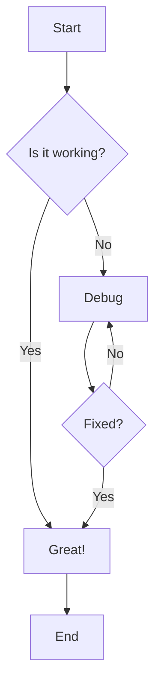
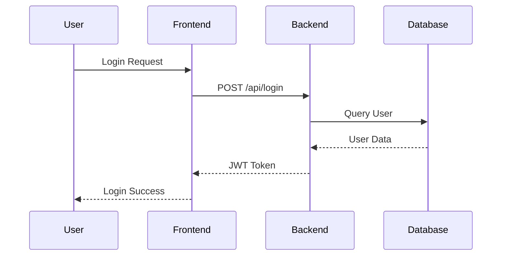
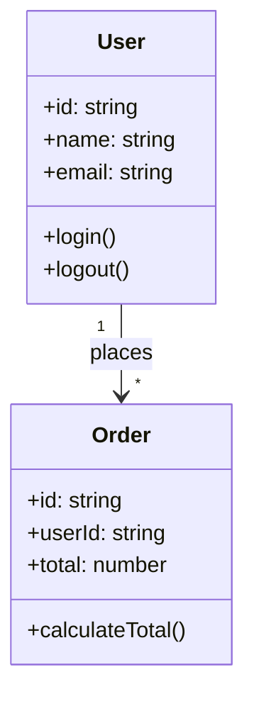
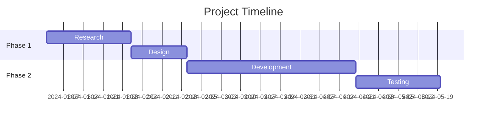

## Flowcharts

````markdown

```mermaid
graph TD
    A[Start] --> B{Is it working?}
    B -->|Yes| C[Great!]
    B -->|No| D[Debug]
    D --> E{Fixed?}
    E -->|Yes| C
    E -->|No| D
    C --> F[End]
```
````

## Sequence Diagrams

````markdown

```mermaid
sequenceDiagram
    participant User
    participant Frontend
    participant Backend
    participant Database

    User->>Frontend: Login Request
    Frontend->>Backend: POST /api/login
    Backend->>Database: Query User
    Database-->>Backend: User Data
    Backend-->>Frontend: JWT Token
    Frontend-->>User: Login Success
```
````

## Class Diagrams

````markdown

```mermaid
classDiagram
    class User {
        +id: string
        +name: string
        +email: string
        +login()
        +logout()
    }

    class Order {
        +id: string
        +userId: string
        +total: number
        +calculateTotal()
    }

    User "1" --> "*" Order : places
```
````

## Gantt Charts

````markdown

```mermaid
gantt
    title Project Timeline
    dateFormat  YYYY-MM-DD
    section Phase 1
    Research       :a1, 2024-01-01, 30d
    Design         :a2, after a1, 20d
    section Phase 2
    Development    :a3, after a2, 60d
    Testing        :a4, after a3, 30d
```
````
