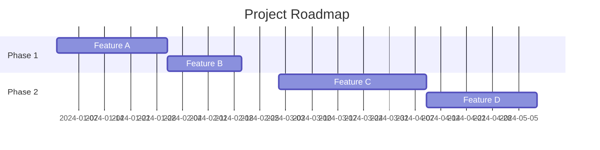

## Product Roadmap

````markdown
# Roadmap

## Current Status

- ✅ v1.0 - Initial release
- ✅ v1.5 - Enhanced features
- 🚧 v2.0 - Major upgrade (in progress)

## Upcoming Releases

### Q1 2024

- [ ] Feature A
- [ ] Feature B
- [ ] Performance improvements

### Q2 2024

- [ ] Feature C
- [ ] Feature D
- [ ] Mobile app beta

### Q3 2024

- [ ] Feature E
- [ ] Feature F
- [ ] v3.0 planning

### Q4 2024

- [ ] v3.0 release
- [ ] Enterprise features
- [ ] Advanced analytics
````

## Feature Roadmap

````markdown
## Feature Roadmap

### Short Term (1-3 months)

| Feature | Status | Priority |
|---------|--------|----------|
| Dark mode | 🚧 In Progress | High |
| API v2 | 📋 Planned | High |
| Better search | 📋 Planned | Medium |

### Medium Term (3-6 months)

| Feature | Status | Priority |
|---------|--------|----------|
| Mobile app | 📝 Research | Medium |
| Team features | 📋 Planned | Medium |
| Integrations | 📝 Research | Low |

### Long Term (6+ months)

| Feature | Status | Priority |
|---------|--------|----------|
| AI features | 💡 Idea | Low |
| Enterprise tier | 💡 Idea | Low |
````

## Timeline Roadmap

````markdown
## Timeline


````
