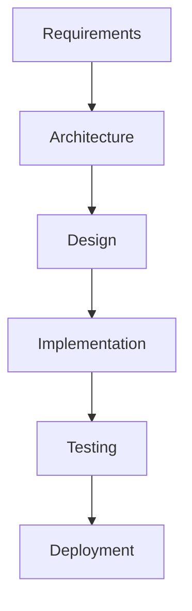

# Write Skills Workflow

## Purpose

Workflow หลักสำหรับการเขียน skills ทั้งหมด:

- **Comprehensive Creation** - ครอบคลุมทุกขั้นตอน
- **Standardized Process** - ทำตามมาตรฐานเดียวกัน
- **Quality First** - เน้นคุณภาพตั้งแต่แรก
- **Documentation Driven** - สร้างเอกสารครบถ้วน

## When to Use

ใช้ workflow นี้เมื่อ:
- สร้าง skill ใหม่ทั้งหมด
- ต้องการครอบคลุมทุกขั้นตอน
- ต้องการความสมบูรณ์สูง
- ต้องการ documentation ครบถ้วน

## Prerequisites

ก่อนเริ่ม workflow:
- [ ] อ่าน `@write-skills` ครบถ้วน
- [ ] ศึกษา examples และ patterns
- [ ] เข้าใจมาตรฐานโครงสร้าง
- [ ] เตรียม tools และ environment

## Steps

### Phase 1: Discovery & Planning

#### 1.1 Requirements Gathering
- **Stakeholder Interviews** - พูดคุยกับผู้เกี่ยวข้อง
- **Use Case Analysis** - วิเคราะห์ use cases ทั้งหมด
- **Technical Requirements** - ระบุความต้องการทางเทคนิค
- **Constraints Analysis** - ระบุข้อจำกัดและ trade-offs

#### 1.2 Research Phase
- **Existing Solutions** - ศึกษา solutions ที่มีอยู่
- **Best Practices** - รวบรวม best practices
- **Technology Assessment** - ประเมิน technologies ที่เกี่ยวข้อง
- **Competitor Analysis** - วิเคราะห์ solutions ที่คล้ายกัน

#### 1.3 Architecture Design


#### 1.4 Project Planning
- **Timeline**: กำหนดระยะเวลา
- **Milestones**: กำหนด milestones หลัก
- **Resources**: จัดสรร resources ที่ต้องการ
- **Risk Assessment**: ประเมินความเสี่ยง

### Phase 2: Design & Prototyping

#### 2.1 Skill Structure Design
```text
skill-name/
├── SKILL.md              # Core definition
├── rules/                # Usage rules
│   ├── 1-setup.md
│   ├── 2-usage.md
│   └── 3-best-practices.md
├── knowledge/            # Core concepts
│   ├── core-concept.md
│   └── best-practices.md
├── reference/            # Examples & links
│   ├── examples.md
│   └── external-links.md
├── examples/            # Usage examples
└── templates/           # Reusable templates
```

#### 2.2 Content Architecture
- **Information Hierarchy**: ออกแบบ hierarchy ของข้อมูล
- **Navigation Structure**: ออกแบบการนำทาง
- **Content Flow**: ออกแบบการไหลของเนื้อหา
- **User Journey**: ออกแบบ user experience

#### 2.3 Prototype Creation
- **MVP Version**: สร้าง minimum viable product
- **User Testing**: ทดสอบกับ users
- **Feedback Integration**: รวม feedback
- **Iteration**: ปรับปรุงตาม feedback

### Phase 3: Content Creation

#### 3.1 Core Content Development
```markdown
---
title: Skill Name
description: Comprehensive description
version: 1.0.0
auto_execution_mode: 3
file-patterns: ["*.md", "*.ts", "*.js"]
follow:
  skills: ["@related-skills"]
  workflows: ["/write-workflows"]
  files: []
  mcp: []
---

# Skill Name

## Purpose

[Clear, concise purpose statement]

## Scope

[Detailed scope definition]

## Implementation

[Implementation details]
```

#### 3.2 Rules Creation
- **Setup Rules**: กฎการตั้งค่า
- **Usage Rules**: กฎการใช้งาน
- **Best Practices**: แนวทางปฏิบัติที่ดี

#### 3.3 Knowledge Development
- **Core Concepts**: แนวคิดหลัก
- **Theoretical Foundation**: พื้นฐานทฤษฎี
- **Practical Applications**: การประยุกต์ใช้
- **Advanced Topics**: หัวข้อขั้นสูง

#### 3.4 Reference Materials
- **Examples**: ตัวอย่างการใช้งานจริง
- **Templates**: templates สำหรับใช้งาน
- **External Links**: แหล่งข้อมูลภายนอก
- **Related Skills**: skills ที่เกี่ยวข้อง

### Phase 4: Implementation & Integration

#### 4.1 File Structure Implementation
```bash
# สร้างโครงสร้าง
mkdir -p skill-name/{rules,knowledge,reference,examples,templates}

# สร้างไฟล์หลัก
touch skill-name/SKILL.md

# สร้าง rules files
touch skill-name/rules/{1-setup,2-usage,3-best-practices}.md

# สร้าง knowledge files
touch skill-name/knowledge/{core-concept,best-practices}.md

# สร้าง reference files
touch skill-name/reference/{examples,external-links}.md
```

#### 4.2 Content Integration
- **Content Population**: ใส่เนื้อหาลงไฟล์
- **Link Management**: จัดการ internal/external links
- **Cross-References**: สร้าง cross-references
- **Navigation Setup**: ตั้งค่า navigation

#### 4.3 Quality Assurance
- **Content Review**: ตรวจสอบคุณภาพเนื้อหา
- **Structure Validation**: ตรวจสอบโครงสร้าง
- **Link Testing**: ทดสอบ links ทั้งหมด
- **Format Consistency**: ตรวจสอบ formatting

### Phase 5: Testing & Validation

#### 5.1 Functional Testing
```bash
# ทดสอบโครงสร้าง
test-structure.sh skill-name/

# ทดสอบเนื้อหา
test-content.sh skill-name/

# ทดสอบ links
test-links.sh skill-name/

# ทดสอบ integrations
test-integrations.sh skill-name/
```

#### 5.2 User Acceptance Testing
- **User Scenarios**: ทดสอบกับ scenarios จริง
- **Usability Testing**: ทดสอบความใช้งานง่าย
- **Documentation Testing**: ทดสอบความเข้าใจง่าย
- **Performance Testing**: ทดสอบประสิทธิภาพ

#### 5.3 Integration Testing
- **System Integration**: ทดสอบกับระบบหลัก
- **Workflow Integration**: ทดสอบกับ workflows อื่น
- **Tool Integration**: ทดสอบกับ tools ที่เกี่ยวข้อง
- **API Integration**: ทดสอบกับ APIs ที่เกี่ยวข้อง

### Phase 6: Documentation & Deployment

#### 6.1 Documentation Creation
- **User Guide**: สร้างคู่มือสำหรับผู้ใช้
- **API Documentation**: สร้างเอกสาร API
- **Developer Guide**: สร้างคู่มือสำหรับนักพัฒนา
- **Troubleshooting Guide**: สร้างคู่มือแก้ไขปัญหา

#### 6.2 Deployment Preparation
```bash
# ตรวจสอบความพร้อม
pre-deployment-check.sh skill-name/

# สร้าง deployment package
create-deployment-package.sh skill-name/

# ทดสอบ deployment
test-deployment.sh skill-name/

# Deploy
deploy-skill.sh skill-name/
```

#### 6.3 Post-Deployment
- **Monitoring Setup**: ตั้งค่า monitoring
- **User Training**: ฝึกอบรมผู้ใช้
- **Feedback Collection**: รวบรวม feedback
- **Maintenance Planning**: วางแผนการบำรุงรักษา

## Templates & Patterns

### Skill Template
```markdown
---
title: {{SKILL_NAME}}
description: {{DESCRIPTION}}
version: 1.0.0
auto_execution_mode: 3
file-patterns: [{{FILE_PATTERNS}}]
follow:
  skills: [{{RELATED_SKILLS}}]
  workflows: ["/write-workflows"]
  files: []
  mcp: []
---

# {{SKILL_NAME}}

## Purpose

{{PURPOSE_STATEMENT}}

## Scope

{{SCOPE_DEFINITION}}

## Implementation

{{IMPLEMENTATION_DETAILS}}

## Verification Checklist

{{VERIFICATION_CHECKLIST}}

## Related Skills

{{RELATED_SKILLS_LIST}}
```

### Content Creation Pattern
1. **Research Phase**
   - ศึกษา sources ที่เกี่ยวข้อง
   - รวบรวม best practices
   - วิเคราะห์ target audience
   - กำหนด key messages

2. **Outline Phase**
   - สร้าง outline หลัก
   - จัดลำดับความสำคัญ
   - กำหนด sections ย่อย
   - สร้าง flow ของเนื้อหา

3. **Drafting Phase**
   - เขียน content ตาม outline
   - เพิ่ม examples และ illustrations
   - สร้าง callouts และ highlights
   - ทำให้ engaging และ useful

4. **Review Phase**
   - ตรวจสอบความถูกต้อง
   - ตรวจสอบความชัดเจน
   - ตรวจสอบความสมบูรณ์
   - ปรับปรุงตาม feedback

### Quality Standards

#### Content Quality
- **Accuracy**: ข้อมูลถูกต้องและเป็นปัจจุบัน
- **Clarity**: เขียนให้เข้าใจง่าย
- **Completeness**:ครอบคลุมทุกสิ่งที่จำเป็น
- **Consistency**: สม่ำเสมอทั้งเอกสาร

#### Structure Quality
- **Organization**: จัดระเบียงเป็นระเบียบ
- **Navigation**: สามารถนำทางได้ง่าย
- **Searchability**: ค้นหาข้อมูลได้ง่าย
- **Accessibility**: สามารถเข้าถึงได้ทุกคน

#### Technical Quality
- **Performance**: โหลดเร็วและทำงานได้ดี
- **Compatibility**: ทำงานได้บน platforms ต่างๆ
- **Maintainability**: บำรุงรักษาง่าย
- **Scalability**: สามารถขยายตัวได้

## Tools & Resources

### Essential Tools
- **Text Editor**: VS Code, Obsidian, Typora
- **Linting Tools**: markdownlint, remark
- **Testing Tools**: link-checker, html-validator
- **Version Control**: Git, GitHub

### Helpful Resources
- **Style Guides**: คู่มือการเขียน
- **Template Libraries**: คลัง templates
- **Example Collections**: คลังตัวอย่าง
- **Best Practices**: แนวทางปฏิบัติ

## Common Challenges & Solutions

### Content Challenges
- **Writer's Block**: ใช้ templates และ examples
- **Scope Creep**: กำหนด boundaries ที่ชัดเจน
- **Technical Accuracy**: ทดสอบกับ experts
- **User Engagement**: ใช้ real-world examples

### Technical Challenges
- **Link Management**: ใช้ automated link checkers
- **Version Control**: ใช้ branching strategies
- **Documentation**: ใช้ documentation generators
- **Testing**: ใช้ automated testing

## Success Metrics

### Quality Metrics
- **Content Accuracy**: 100% ความถูกต้อง
- **User Satisfaction**: >4.5/5 rating
- **Documentation Coverage**: >90% coverage
- **Bug Reports**: <5 critical issues

### Usage Metrics
- **Adoption Rate**: >70% target users
- **Task Completion**: >80% success rate
- **Time to Value**: <30 minutes to first value
- **Retention**: >90% continued usage

## Related Workflows

- `@add-skills` - สำหรับการเพิ่ม skills ใหม่
- `@update-skills` - สำหรับการอัพเดท skills ที่มีอยู่
- `@write-workflows` - สำหรับการเขียน workflows
- `@write-markdown` - สำหรับการเขียน documentation

## Continuous Improvement

### Feedback Loops
- **User Feedback**: รวบรวม feedback จากผู้ใช้
- **Analytics**: วิเคราะห์ usage patterns
- **Performance Monitoring**: ติดตาม performance metrics
- **Regular Reviews**: ทบทวนเป็นประจำ

### Update Cycles
- **Monthly Reviews**: ทบทวนเนื้อหาประจำ
- **Quarterly Updates**: อัพเดท features ใหญ่
- **Annual Overhauls**: ปรับโครงสร้างทั้งหมด
- **Community Contributions**: รับ contributions จาก community

## Success Criteria

✅ **Complete Skill**: Skill สร้างเสร็จครบถ้วน
✅ **Quality Assured**: ผ่าน quality checks ทั้งหมด
✅ **User Ready**: พร้อมให้ผู้ใช้ใช้งาน
✅ **Documented**: Documentation ครบถ้วน
✅ **Integrated**: ทำงานร่วมกับระบบได้
✅ **Maintainable**: บำรุงรักษาง่ายในอนาคต
